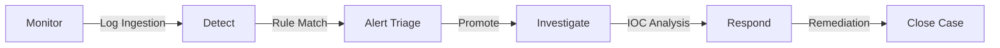

# Security Operations Workflow

The **zcrAI** platform is built around a streamlined **SOC Lifecycle**. This workflow ensures that threats are detected, analyzed, and neutralized efficiently.

## Master System Reference (Combined Table)

This table maps every major action in the platform to its specific page.

| Category | Step / Function | Page Name | URL Path | Key Action |
| :--- | :--- | :--- | :--- | :--- |
| **Operations** | **1. Monitor** | **Dashboard** | `/` | Monitor KPIs & System Health. |
| | **2. Detect** | **Detection Rules** | `/detection` | Enable/Disable Sigma rules. |
| | **3. Triage** | **Alerts** | `/alerts` | Accept or Close incoming alerts. |
| | *Fast Triage* | **Alert Queue** | `/queue` | Rapid fire triage (Inbox zero style). |
| | **4. Investigate** | **Case Board** | `/cases` | Assign & track case progress. |
| | *Deep Dive* | **Case Details** | `/cases/:id` | Analyze Timeline & Evidence. |
| | **5. Respond** | **Playbooks** | `/playbooks` | Run automated response actions. |
| | *Approvals* | **Approvals** | `/approvals` | Authorize high-risk automated actions. |
| | **Reporting** | **Reports** | `/reports` | Generate PDF executive summaries. |
| **Analysis** | **Log Hunting** | **Log Viewer** | `/logs` | Search raw logs (Splunk-like). |
| | **Enrichment** | **Threat Intel** | `/threat-intel` | Lookup IP/Hash reputation. |
| | **IOCs** | **Observables** | `/observables` | Cross-referenced indicator view. |
| **Settings** | **Integrations** | **Integrations** | `/settings/integrations` | Connect API Keys (EDR, VT). |
| | **Notifications** | **Notification Channels** | `/settings/notifications` | Setup Slack/Teams webhooks. |
| | **Access** | **Users & Teams** | `/settings/users` | Manage analyst access. |
| | **Billing** | **Subscription** | `/settings/subscription` | View limits & usage. |
| | **Security** | **SSO / MFA** | `/settings/sso` | Configure Login & 2FA. |
| | **Auditing** | **Audit Logs** | `/settings/audit-logs` | Track usage & internal changes. |
| | **System** | **System Health** | `/settings/system` | Monitor CPU, RAM, Services. |
| | **Data** | **Retention** | `/settings/retention` | Configure log storage duration. |

## Detailed Breakdown

### 1. Monitor (Situational Awareness)
**Goal**: Keep an eye on the overall health of the organization.
*   **Action**: Analyst checks the **Dashboard** for spikes in `Active Cases` or `Events per Second (EPS)`.
*   **Page**: [Dashboard](monitor.md)

## 2. Detect (Automated Identification)
**Goal**: Find specific malicious patterns automatically.
*   **Mechanism**: **Detection Rules** (Sigma) scan incoming logs in real-time.
*   **Outcome**: When a match is found (e.g., "Mimikatz detected"), an **Alert** is generated.

## 3. Triage (Alert Validation)
**Goal**: Filter out noise and identify real threats.
*   **Action**: Analyst reviews the **Alerts Queue**.
    *   **False Positive**: Mark as `Closed`.
    *   **True Positive**: Click **Create Case** to promote it for investigation.

## 4. Investigate (Deep Analysis)
**Goal**: Understand the scope and root cause.
*   **Action**: Work inside the **Case Board**.
    *   **Timeline**: When did it start?
    *   **Observables**: Search **Threat Intel** for reputation of IP addresses or Hashes involved.
*   **Outcome**: Confirmed incident scope (e.g., "Host A is compromised by Malware X").

## 5. Respond (Containment)
**Goal**: Stop the bleeding.
*   **Action**: Execute **Playbooks** (Automation).
    *   *Example*: "Isolate Host" via CrowdStrike or "Block IP" on Firewall.
*   **Outcome**: Threat is contained, and the case can be marked as `Resolved`.
