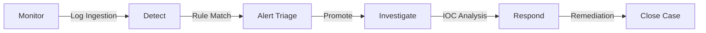

# Security Operations Workflow

The **zcrAI** platform is built around a streamlined **SOC Lifecycle**. This workflow ensures that threats are detected, analyzed, and neutralized efficiently.

## 1. Monitor (Situational Awareness)
**Goal**: Keep an eye on the overall health of the organization.
*   **Action**: Analyst checks the **Dashboard** for spikes in `Active Cases` or `Events per Second (EPS)`.
*   **Outcome**: Early detection of anomalies (e.g., mass login failures).

## 2. Detect (Automated Identification)
**Goal**: Find specific malicious patterns automatically.
*   **Mechanism**: **Detection Rules** (Sigma) scan incoming logs in real-time.
*   **Outcome**: When a match is found (e.g., "Mimikatz detected"), an **Alert** is generated.

## 3. Triage (Alert Validation)
**Goal**: Filter out noise and identify real threats.
*   **Action**: Analyst reviews the **Alerts Queue**.
    *   **False Positive**: Mark as `Closed`.
    *   **True Positive**: Click **Create Case** to promote it for investigation.

## 4. Investigate (Deep Analysis)
**Goal**: Understand the scope and root cause.
*   **Action**: Work inside the **Case Board**.
    *   **Timeline**: When did it start?
    *   **Observables**: Search **Threat Intel** for reputation of IP addresses or Hashes involved.
*   **Outcome**: Confirmed incident scope (e.g., "Host A is compromised by Malware X").

## 5. Respond (Containment)
**Goal**: Stop the bleeding.
*   **Action**: Execute **Playbooks** (Automation).
    *   *Example*: "Isolate Host" via CrowdStrike or "Block IP" on Firewall.
*   **Outcome**: Threat is contained, and the case can be marked as `Resolved`.
